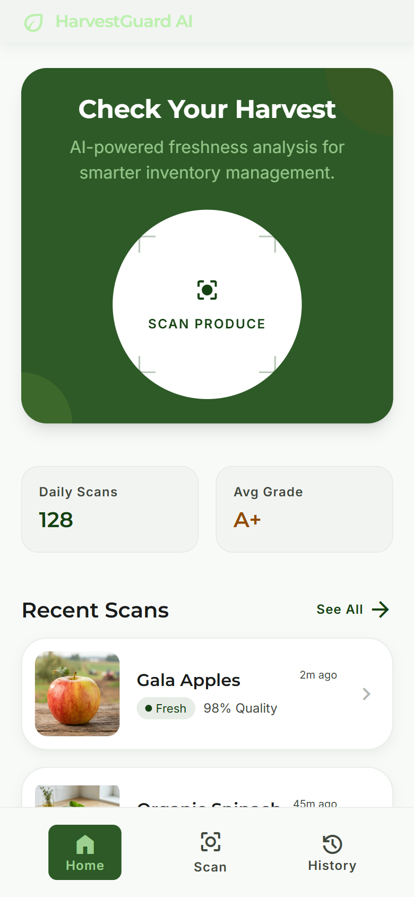
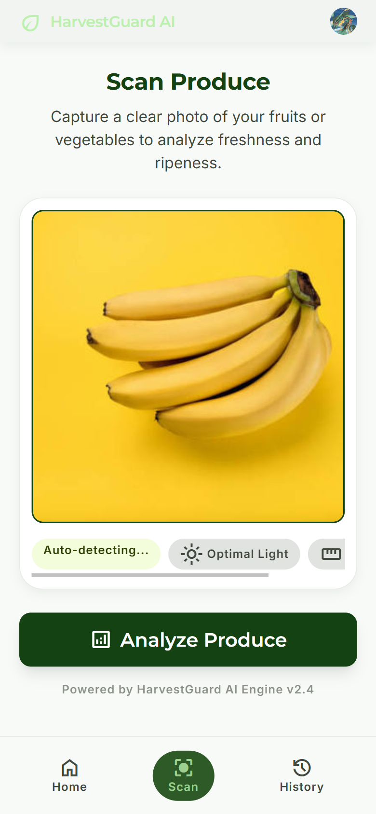
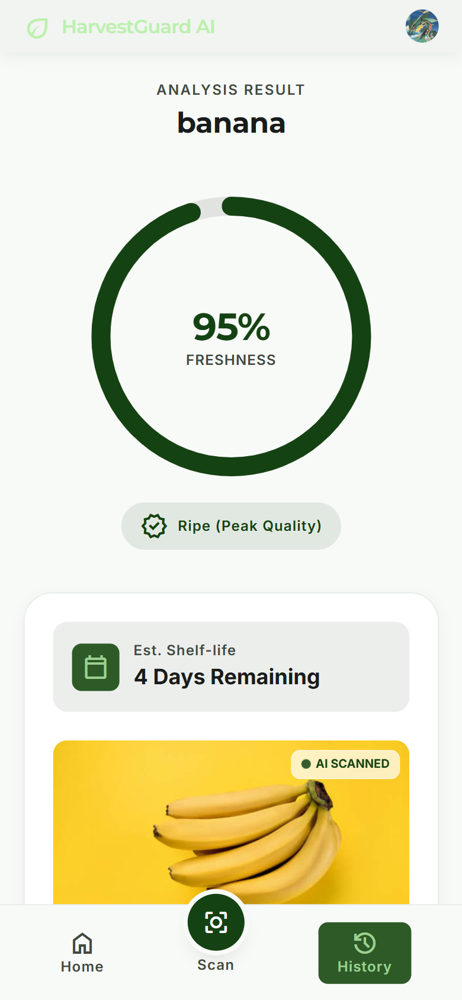
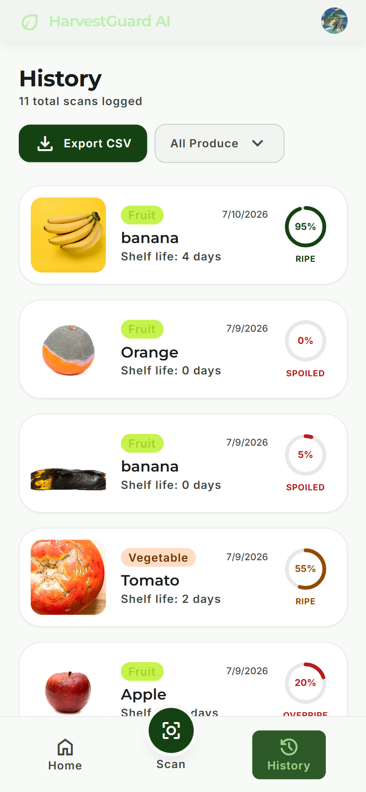

# HarvestGuard AI

**AI-powered post-harvest produce quality & shelf-life estimator**, built for CII Post-Harvest Hackathon (organised by CII-FACE in collaboration with IIT Guwahati Technology Incubation Centre).

Farmers and vendors can photograph any piece of produce and instantly get its freshness score, estimated shelf life, and a storage recommendation — helping reduce avoidable post-harvest losses at the farm and market-handling stages, where losses are concentrated most.

🔗 **Live demo:** [HarvestGuard AI](https://harvestguard-ai.vercel.app)

---

## How it works

1. User uploads or captures a photo of produce.
2. **Google Gemini (vision)** analyzes the image and extracts structured data — produce type, ripeness stage, visible defects.
3. A **scikit-learn regression model** (trained on a custom post-harvest spoilage dataset) takes those structured signals and predicts numeric shelf-life in days.
4. Result — freshness score, shelf-life estimate, and a storage recommendation — is shown to the user and saved to their scan history.

This two-layer design means the app isn't just describing what it sees with an LLM — it produces a grounded, numeric prediction backed by a model trained specifically on post-harvest spoilage patterns.

## Features

- 🔐 Authentication via Clerk
- 📸 Photo-based produce analysis (Gemini vision)
- 📊 Freshness score + shelf-life prediction (scikit-learn)
- 🗂️ Scan history with pagination and category filtering (fruit/vegetable)
- 📥 CSV export of scan history
- ⚡ Loading states and graceful error handling throughout

## Tech stack

| Layer | Technology |
|---|---|
| Frontend | Next.js 14 (App Router), TypeScript, Tailwind CSS |
| Auth | Clerk |
| Database | NeonDB (PostgreSQL) via Prisma ORM |
| Vision AI | Google Gemini API |
| ML Prediction | Python, FastAPI, scikit-learn (RandomForestRegressor) |
| Hosting | Vercel (frontend) + Render (FastAPI microservice) |
| Design | Google Stitch |
| Build tooling | Google Antigravity, Jules (async task automation) |

## Currently supports

Tomato, Potato, Banana, Apple, Mango — with the underlying dataset structured to extend easily to additional produce types (onion, grapes, orange, strawberry, papaya, carrot, cabbage, spinach, cucumber, capsicum, brinjal, cauliflower, and grains).

## Screenshots

| Home | Scan | Results | History |
|---|---|---|---|
|  |  |  |  |

## Running locally

### Prerequisites
- Node.js 18+
- Python 3.10+
- A Gemini API key ([Google AI Studio](https://aistudio.google.com/apikey))
- A NeonDB database ([neon.tech](https://neon.tech))
- A Clerk account ([clerk.com](https://clerk.com))

### 1. Clone and install
```bash
git clone https://github.com/learner-Piyush/harvestguard-ai.git
cd harvestguard-ai
npm install
```

### 2. Environment variables
Create a `.env.local` file in the project root:
```
GEMINI_API_KEY=your_gemini_api_key
DATABASE_URL=your_neondb_connection_string
NEXT_PUBLIC_CLERK_PUBLISHABLE_KEY=your_clerk_publishable_key
CLERK_SECRET_KEY=your_clerk_secret_key
FASTAPI_URL=http://localhost:8000
```

### 3. Set up the database
```bash
npx prisma generate
npx prisma db push
```

### 4. Run the FastAPI microservice
```bash
cd fastapi_service
pip install -r requirements.txt
python train_model.py
uvicorn main:app --reload --port 8000
```

### 5. Run the frontend (in a separate terminal)
```bash
npm run dev
```

Visit `http://localhost:3000`.

## Project structure

```
harvestguard-ai/
├── app/
│   ├── layout.tsx              # Root layout with ClerkProvider
│   ├── page.tsx                 # Home
│   ├── scan/page.tsx            # Upload & analyze screen
│   ├── results/page.tsx         # Analysis results
│   ├── history/                 # Scan history + pagination + filter + CSV export
│   └── api/
│       ├── analyze/route.ts     # Calls Gemini + FastAPI prediction
│       └── scans/route.ts       # GET/POST scans via Prisma
├── prisma/
│   └── schema.prisma            # Scan model, NeonDB datasource
├── fastapi_service/
│   ├── main.py                  # FastAPI app, /predict endpoint
│   ├── train_model.py           # Trains and pickles the RandomForest model
│   ├── data/produce_shelf_life.csv
│   └── requirements.txt
└── README.md
```

## Team

Built by Piyush Raj for CII Post-Harvest Hackathon 2026.

## Acknowledgements

- CII-FACE (Food and Agriculture Centre of Excellence) & IIT Guwahati Technology Incubation Centre for organizing the hackathon
- Google AI Studio, Stitch, Antigravity, and Jules for accelerating development
